# Analysis

This section presents tools for analysing model generate data, including functions to
extract metrics and plot graphs.

## Setup

### Makie

The Makie.jl ecosystem is used to produce figures.

Install additional packages if necessary

```julia
]add GeoMakie GraphMakie
```

Install a Makie [backend](https://docs.makie.org/stable/explanations/backends/) of your
choice. WGLMakie is more flexible for our workflows, but GLMakie is a good choice too.

```julia
]add WGLMakie
```

Import additional packages and the visualization extension will compile.

```julia
using WGLMakie, GeoMakie, GraphMakie
using ADRIA
using Statistics
```

If using GLMakie, the plots will appear in the VS Code plots pane.
You may prefer figures to appear in a separate window, in which case deactivate the inline
plotting feature.

```julia
Makie.inline!(false)
```

### Result Set

All metrics and visualization tools presented here can be used with data generated from
ADRIAmod. Following, we show usage examples considering ADRIA result set `rs`:

```julia
# Load domain data
dom = ADRIA.load_domain("path to domain data")

# Create some scenarios
num_samples = 4096
scens = ADRIA.sample(dom, num_samples)

# Run the model for generated scenarios
rcp_45 = "45"
rs = ADRIA.run_scenarios(dom, scens, rcp_45)

# Visualize results (in terms of scenario absolute coral cover)
s_tac = ADRIA.metrics.scenario_total_cover(rs)
ADRIA.viz.scenarios(rs, s_tac)
```

See the previous sections [Loading a Domain](@ref), [Generating scenarios](@ref) and
[Running scenarios](@ref) for more information.

## Extracting results

A range of metrics are defined as part of the ADRIA framework. See the [Metrics](@ref)
page for more details.

Here, we extract results for specific metrics for each timestep and sites for all the
scenarios run. The result of each line above is a 3-dimensional Array of timesteps, sites
and scenarios:

```julia
tac = ADRIA.metrics.total_absolute_cover(rs)
rsv = ADRIA.metrics.relative_shelter_volume(rs)
juves = ADRIA.metrics.relative_juveniles(rs)
```

We can also look at scenario-level metrics. They aggregate the above metrics across the
`site` dimension and indicate the _outcomes_ under a given intervention (or non-intervention) option
and environmental condition.

The result is a 2-dimensional array of timesteps and scenarios:

```julia
s_tac = ADRIA.metrics.scenario_total_cover(rs)
s_rsv = ADRIA.metrics.scenario_rsv(rs)
s_juves = ADRIA.metrics.scenario_relative_juveniles(rs)
```

## Visualization

The examples below are to illustrate usage. For further information on each method of
analysis, see the documentation for the given function.

Some options shared for the plots below are defined here.

```julia
# Some shared options for the example plots below
fig_opts = Dict(:size => (1600, 800))

# Factors of Interest
opts = Dict(
    :factors => [
        :RCP,
        :dhw_scenario,
        :wave_scenario,
        :guided,
        :N_seed_TA,
        :N_seed_CA,
        :fogging,
        :SRM,
        :a_adapt
    ]
)
```

### Scenario outcomes

One can plot a quick scenario overview:

```julia
fig_s_tac = ADRIA.viz.scenarios(
    rs, s_tac; fig_opts=fig_opts, axis_opts=Dict(:ylabel => "Scenario Total Cover")
)
save("scenarios_tac.png", fig_s_tac)
```

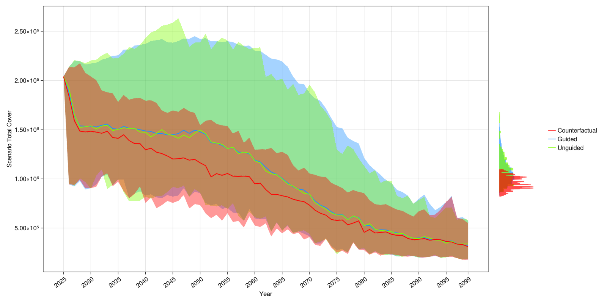

And compose a figure with subplots. In the example below we also use the parameter `opts`
that accepts the keys `by_RCP` to group scenarios by RCP (default is `false`), `legend`
to plot the legend (default is `true`) and `summarize` to plot confidence intervals instead
of plotting each series (default is `true`):

```julia
tf = Figure(size=(1600, 600))  # size of figure

# Implicitly create a single figure with 2 columns
ADRIA.viz.scenarios!(
    tf[1, 1],
    rs,
    s_tac;
    opts=Dict(:by_RCP => false, :legend => false),
    axis_opts=Dict(:title => "TAC [m²]"),
);
ADRIA.viz.scenarios!(
    tf[1, 2],
    rs,
    s_juves;
    opts=Dict(:summarize => false),
    axis_opts=Dict(:title => "Juveniles [%]"),
);

tf  # display the figure
save("aviz_scenario.png", tf)  # save the figure to a file
```

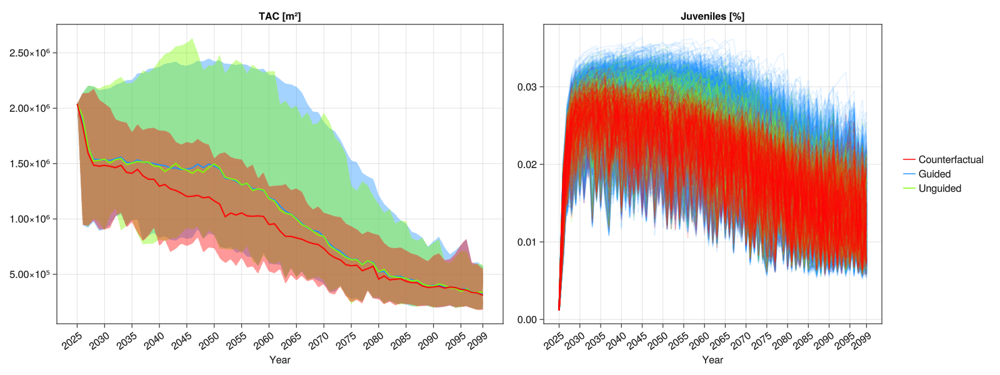

### Intervention location selection - visualisation

Plot spatial colormaps of site selection frequencies and other available site selection metrics.

```julia
# Calculate frequencies with which each site was selected at each rank
rank_freq = ADRIA.decision.ranks_to_frequencies(
    rs.ranks[intervention=1];
    agg_func=x -> dropdims(sum(x; dims=:timesteps); dims=:timesteps),
)

# Plot 1st rank frequencies as a colormap
rank_fig = ADRIA.viz.ranks_to_frequencies(rs, rank_freq, 1; fig_opts=Dict(:size=>(1200, 800)))

save("single_rank_plot.png", rank_fig)
```

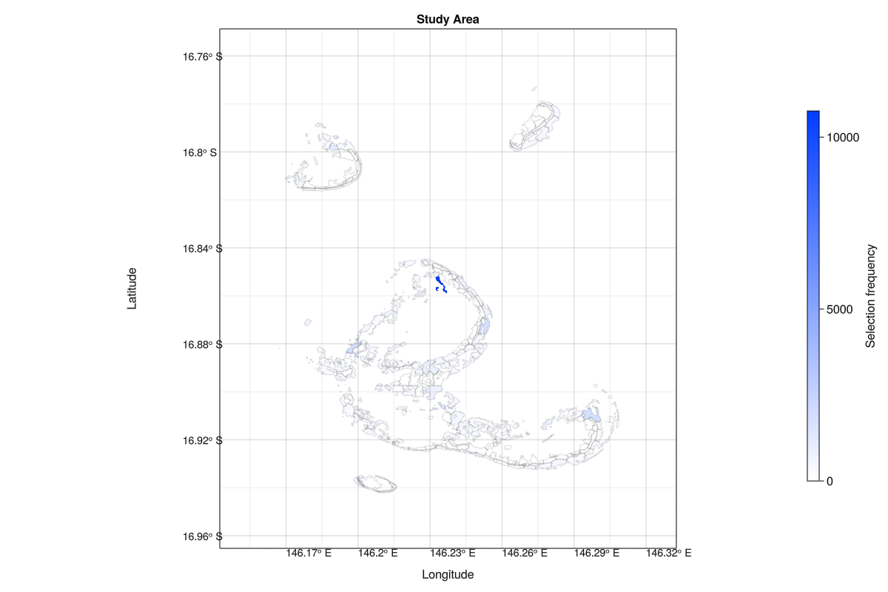

```julia
# Plot 1st, 2nd and 3rd rank frequencies as an overlayed colormap
rank_fig = ADRIA.viz.ranks_to_frequencies(rs, rank_freq, [1, 2, 3]; fig_opts=Dict(:size=>(1200, 800)))

save("ranks_plot.png", rank_fig)
```

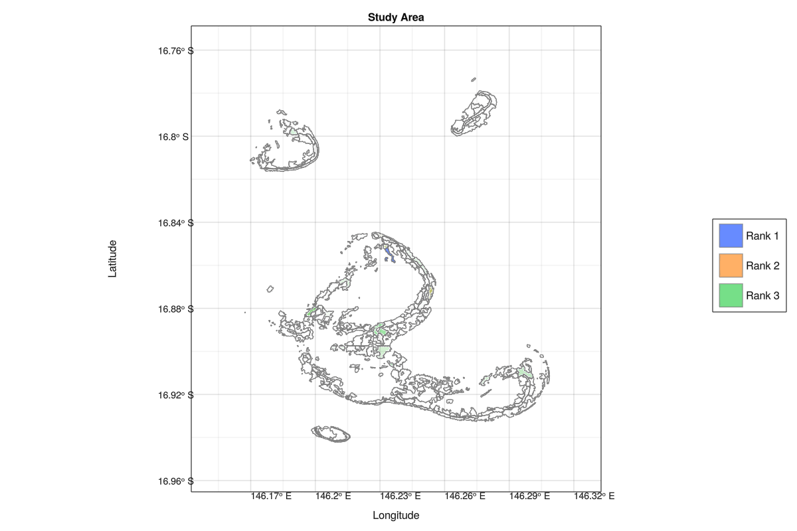

### PAWN sensitivity (heatmap overview)

The PAWN sensitivity analysis method is a moment-independent approach to Global Sensitivity
Analysis. It is described as producing robust results at relatively low sample sizes, and
is used to screen factors (i.e., identification of important factors) and rank factors as
well (ordering factors by their relative contribution towards a given quantity of interest).

```julia
# Sensitivity (of mean scenario outcomes to factors)
mean_s_tac = vec(mean(s_tac, dims=1))
tac_Si = ADRIA.sensitivity.pawn(rs, mean_s_tac)
pawn_fig = ADRIA.viz.pawn(
    tac_Si;
    opts,
    fig_opts
)
save("pawn_si.png", pawn_fig)
```

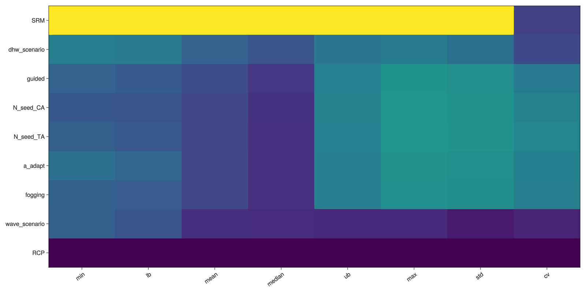

### Temporal Sensitivity Analysis

Temporal (or Time-varying) Sensitivity Analysis applies sensitivity analysis to model
outputs over time. The relative importance of factors and their influence on outputs over
time can then be examined through this analysis.

```julia
tsa_s = ADRIA.sensitivity.tsa(rs, s_tac)
tsa_fig = ADRIA.viz.tsa(
    rs,
    tsa_s;
    opts,
    fig_opts
)
save("tsa.png", tsa_fig)
```

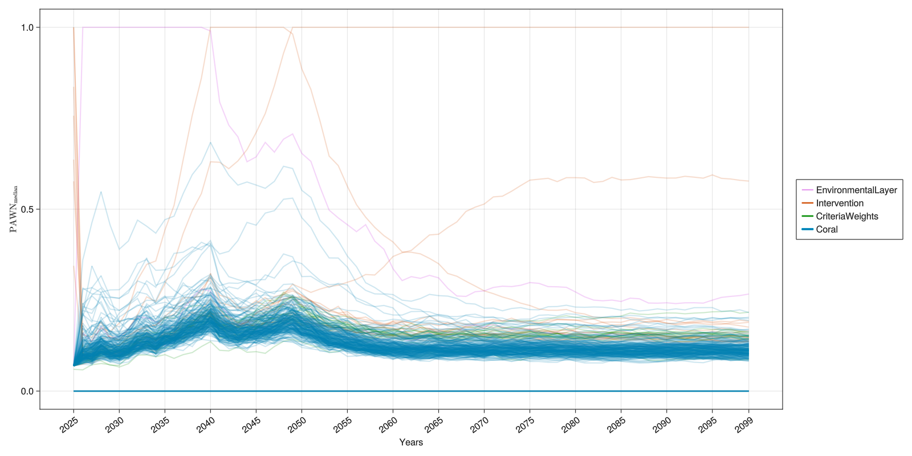


### Convergence Analysis

When undertaking sensitivity analysis it is important to have a sufficient number of samples
such that the sensitivity measure converges to a stable state. To assess whether sufficient
samples have been taken a convergence analysis can be conducted. One approach is to draw a
large sample and then iteratively assess stability of the sensitivity metric using an
increasing number of sub-samples. The sensitivity metric is described as having "converged"
if there is little to no fluctuations/variance for a given sample size. The analysis can
help determine if too little (or too many) samples have taken for the purpose of sensitivity
analysis.

The function `sensitivity.convergence` can be used to calculate a sensitivity measure for an
increasing number of samples. The result can then be plotted as band plots or a heat map
using `viz.convergence`.

```julia
outcome = dropdims(mean(ADRIA.metrics.scenario_total_cover(rs); dims=:timesteps), dims=:timesteps)

# Display convergence for specific factors of interest ("foi") within a single figure.
# Bands represent the 95% confidence interval derived from the number of conditioning
# points, the default for which is ten (i.e., 10 samples).
# Due to the limited sample size, care should be taken when interpreting the figure.
foi = [:dhw_scenario, :wave_scenario, :guided]
Si_conv = ADRIA.sensitivity.convergence(scens, outcome, foi)
conv_series_fig = ADRIA.viz.convergence(Si_conv, foi)
save("convergence_factors_series.png", conv_series_fig)

# Convergence analysis of factors grouped by model component as a heat map
components = [:EnvironmentalLayer, :Intervention, :Coral]
Si_conv = ADRIA.sensitivity.convergence(rs, scens, outcome, components)
conv_hm_fig = ADRIA.viz.convergence(Si_conv, components; opts=Dict(:viz_type=>:heatmap))
save("convergence_components_heatmap.png", conv_hm_fig)
```

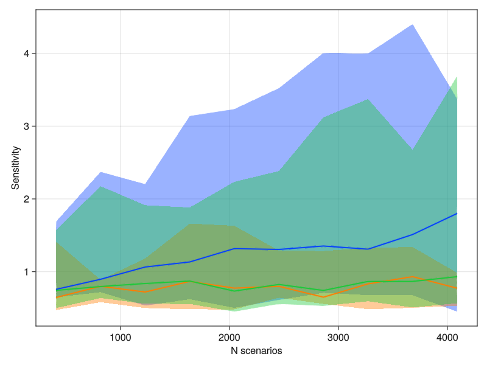
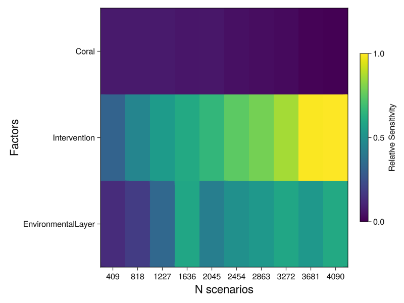

### Time Series Clustering

The Time Series Clustering algorithm clusters together series (typically time series)
with similar behavior. This is achieved by computing the Euclidian distance between each
pair of series weighted by a correlation factor that takes into account the quotient
between their complexities. When plotting `clustered_scenarios`, the kwarg `opts` can be
used with the key `:summarize` to plot the confidence intervals of each cluster instead of
each series individually (default is `true`).

```julia
# Extract metric from scenarios
s_tac = ADRIA.metrics.scenario_total_cover(rs)

# Cluster scenarios
n_clusters = 4
clusters = ADRIA.analysis.cluster_scenarios(s_tac, n_clusters)

axis_opts = Dict(
    :title => "Time Series Clustering with $n_clusters clusters",
    :ylabel => "TAC [m²]",
    :xlabel => "Timesteps [years]",
)

tsc_fig = ADRIA.viz.clustered_scenarios(
    s_tac, clusters; opts=Dict(:summarize => true), fig_opts=fig_opts, axis_opts=axis_opts
)

# Save final figure
save("tsc.png", tsc_fig)
```

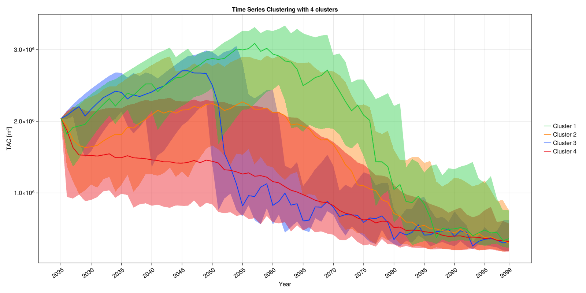

### Target clusters

One can also target scenarios that belong to specific clusters (like clusters with higher
median value for some outcome):

```julia
# Extract metric from scenarios
asv = ADRIA.metrics.absolute_shelter_volume(rs)

# Time series summarizing scenarios for each site
asv_site_series = ADRIA.metrics.loc_trajectory(median, asv)

# Cluster scenarios
n_clusters = 6
asv_clusters = ADRIA.analysis.cluster_scenarios(asv_site_series, n_clusters)

# Target scenarios that belong to the two lowest value clusters
lowest = x -> x .∈ [sort(x; rev=true)[1:2]]
asv_target = ADRIA.analysis.find_scenarios(asv_site_series, asv_clusters, lowest)

# Plot targeted scenarios
axis_opts = Dict(:ylabel => "Absolute Shelter Volume", :xlabel => "Timesteps [years]")

tsc_asc_fig = ADRIA.viz.clustered_scenarios(
    asv_site_series, asv_target; axis_opts=axis_opts, fig_opts=fig_opts
)

# Save final figure
save("tsc_asv.png", tsc_asc_fig)
```

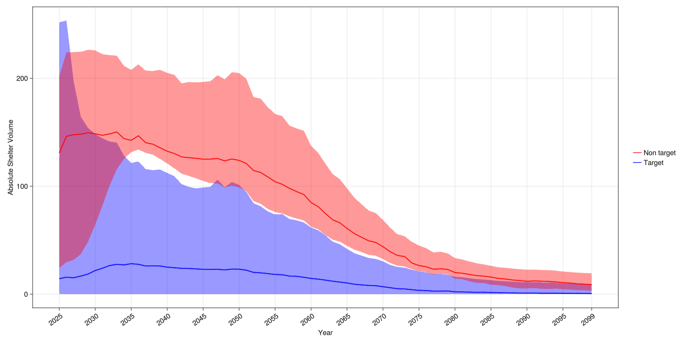

### Multiple Time Series Clustering

It is possible to perform time series clustering for different metric outcomes and find
scenarios that behave the same across all of them. Currently there is no visualization
function for this.

```julia
metrics::Vector{ADRIA.metrics.Metric} = [
    ADRIA.metrics.scenario_total_cover,
    ADRIA.metrics.scenario_asv,
    ADRIA.metrics.scenario_absolute_juveniles,
]

outcomes = ADRIA.metrics.scenario_outcomes(rs, metrics)
n_clusters = 6

# Clusters matrix
outcomes_clusters::AbstractMatrix{Int64} = ADRIA.analysis.cluster_scenarios(
    outcomes, n_clusters
)

# Filter scenarios that belong to on of the 4 high value clusters for all outcomes
highest_clusters(x) = x .∈ [sort(x; rev=true)[1:4]]
robust_scens = ADRIA.analysis.find_scenarios(outcomes, outcomes_clusters, highest_clusters)
```

### Time Series Clustering Map

When using Time Series Clustering to cluster among multiple locations using some metric, it
is possible to visualize the result as a map.

```julia
# Extract metric from scenarios
tac = ADRIA.metrics.total_absolute_cover(rs)

# Get a timeseries summarizing the scenarios for each site
tac_site_series = ADRIA.metrics.loc_trajectory(median, tac)

# Cluster scenarios
n_clusters = 6
clusters = ADRIA.analysis.cluster_scenarios(tac_site_series, n_clusters)

# Get a vector summarizing the scenarios and timesteps for each site
tac_sites = ADRIA.metrics.per_loc(median, tac)

# Plot figure
tsc_map_fig = ADRIA.viz.map(rs, tac_sites, clusters)

# Save final figure
save("tsc_map.png", tsc_map_fig)
```

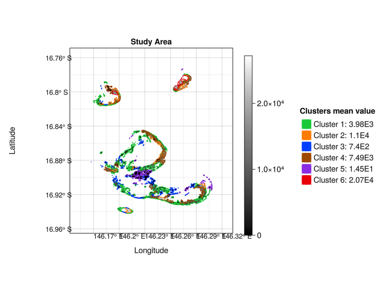

### Rule Induction (using Series Clusters)

After clustering, it is possible to target some specific scenarios based on each cluster
median outcome temporal variability:

```julia
# Find Time Series Clusters
s_tac = ADRIA.metrics.scenario_total_cover(rs)
num_clusters = 6
clusters = ADRIA.analysis.cluster_scenarios(s_tac, num_clusters)

# Target scenarios
target_clusters = ADRIA.analysis.target_clusters(clusters, s_tac)
```

Using this vector if target clusters, together with the parameters used to generate each
scenario, it is possible to use a Rule Induction algorithm (SIRUS) and plot each extracted
rule as a scatter graph:

```julia
# Select only desired features
fields_iv = ADRIA.component_params(rs, [Intervention, CriteriaWeights]).fieldname
scenarios_iv = scens[:, fields_iv]

# Use SIRUS algorithm to extract rules
max_rules = 10
rules_iv = ADRIA.analysis.cluster_rules(target_clusters, scenarios_iv, max_rules)

# Plot scatters for each rule highlighting the area selected them
rules_scatter_fig = ADRIA.viz.rules_scatter(
    rs,
    scenarios_iv,
    target_clusters,
    rules_iv;
    fig_opts=fig_opts,
    opts=opts
)

# Save final figure
save("rules_scatter.png", rules_scatter_fig)
```

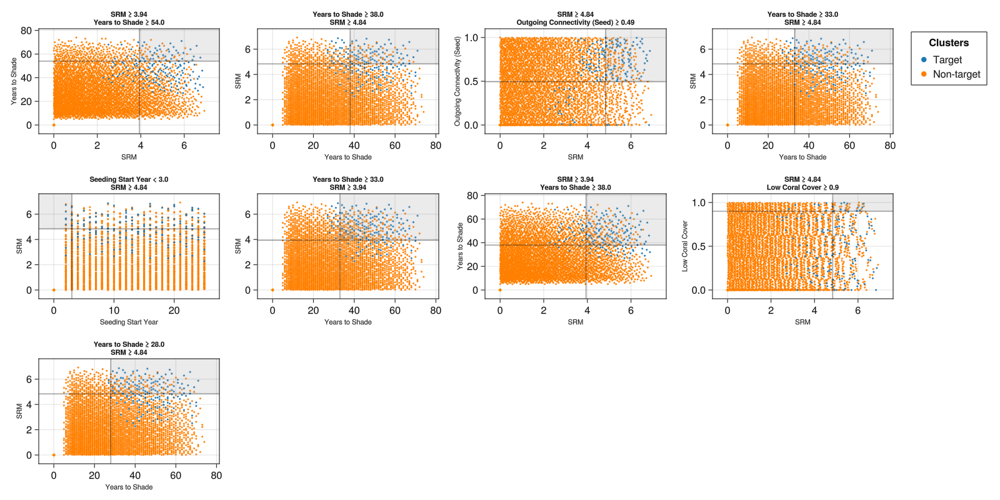

### Regional Sensitivity Analysis

Regional Sensitivity Analysis is a monte-carlo filtering approach. The aim of RSA is to aid
in identifying which (group of) factors drive model outputs and their active areas of
factor space.

```julia
tac_rs = ADRIA.sensitivity.rsa(rs, mean_s_tac; S=10)
rsa_fig = ADRIA.viz.rsa(
    rs,
    tac_rs,
    ["dhw_scenario", "wave_scenario", "N_seed_TA", "N_seed_CA", "fogging", "SRM"];
    opts,
    fig_opts
)
save("rsa.png", rsa_fig)
```

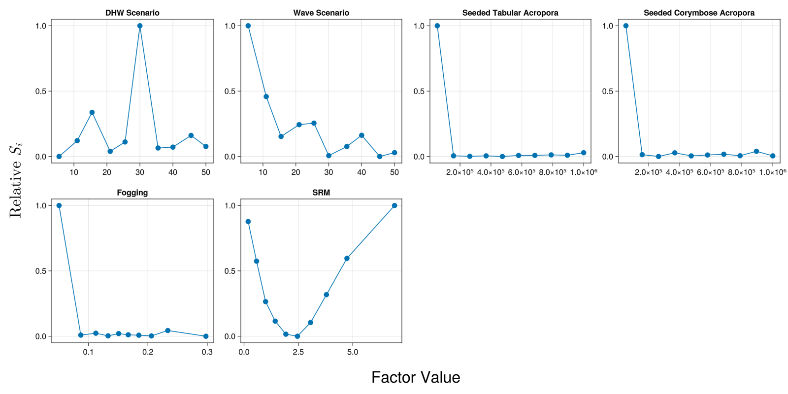

### Outcome mapping

A monte-carlo filtering approach similar to Regional Sensitivity Analysis.

As the name implies, outcome mapping aids in identifying the relationship between model
outputs and the region of factor space that led to those outputs.

```julia
tf = Figure(size=(1600, 1200))  # size of figure

# Indicate factor values that are in the top 50 percentile
tac_om_50 = ADRIA.sensitivity.outcome_map(rs, mean_s_tac, x -> any(x .>= 0.5), foi; S=20)
ADRIA.viz.outcome_map!(
    tf[1, 1],
    rs,
    tac_om_50,
    foi;
    axis_opts=Dict(:title => "Regions which lead to Top 50th Percentile Outcomes", :ylabel => "TAC [m²]")
)

# Indicate factor values that are in the top 30 percentile
tac_om_70 = ADRIA.sensitivity.outcome_map(rs, mean_s_tac, x -> any(x .>= 0.7), foi; S=20)
ADRIA.viz.outcome_map!(
    tf[2, 1],
    rs,
    tac_om_70,
    foi;
    axis_opts=Dict(:title => "Regions which lead to Top 30th Percentile Outcomes", :ylabel => "TAC [m²]"))

save("outcome_map.png", tf)
```

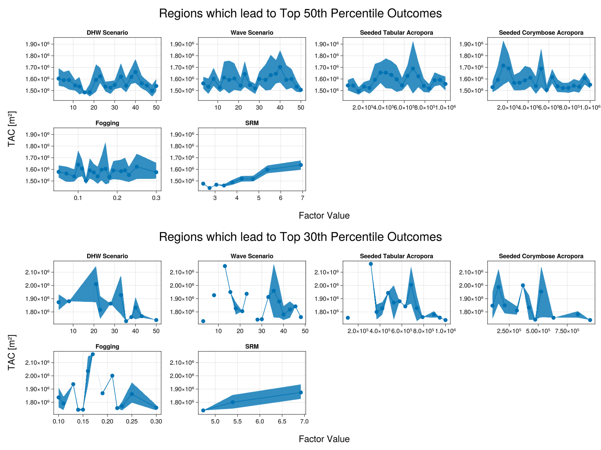

### GUI for high-level exploration (prototype only!)

```julia
# To explore results interactively
ADRIA.viz.explore("path to Result Set")

# or, if the result set is already loaded:
# ADRIA.viz.explore(rs)
```

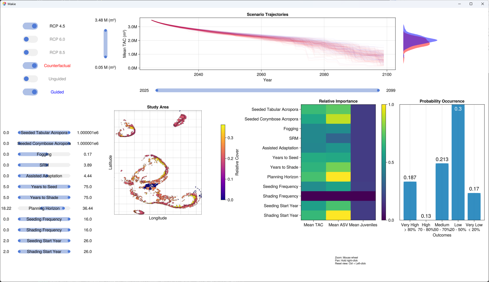
