# Analysis

This section presents tools for analysing model generate data, including functions to
extract metrics and plot graphs.

## Setup

### Selecting and configuring a `Makie` backend

The `Makie.jl` ecosystem is used to produce figures as part of the `viz` extension of `ADRIA`.

`Makie` is configured as an extension to `ADRIA`. This means the standard installation of `ADRIA` does not, by default, include the `viz` extension dependencies.

To enable the `viz` extension, firstly install the following packages:

```julia
]add GeoMakie GraphMakie
```

`Makie` allows the selection of different rendering backends, this allows it to work in a variety of environments. To learn more about Makie backends, see [here](https://docs.makie.org/stable/explanations/backends/).

For example, let's install the `WGLMakie` backend. `WGLMakie` is more flexible for our workflows, though `GLMakie` is a good choice too.

To install the `WGLMakie` backend:

```julia
]add WGLMakie
```

To trigger compilation of the `viz` extension, we must **always** import the following dependencies in our analysis script(s), regardless of your backend selection;

```julia
using GeoMakie, GraphMakie

# Then import the chosen backend, such as:
using WGLMakie
```

The example scripts below assume the following imports

```julia
using ADRIA
# Always imported regardless of backend
using GeoMakie, GraphMakie

# Backend selection
using WGLMakie

# Statistics library used later in this doc
using Statistics
```

### GLMakie inline plots

If using `GLMakie`, the plots will appear in the VS Code plots pane.

You may prefer figures to appear in a separate window, in which case deactivate the inline
plotting feature.

```julia
Makie.inline!(false)
```

### Result Set

All metrics and visualization tools presented here can be used with data generated from
ADRIAmod. Following, we show usage examples considering ADRIA result set `rs`:

```julia
# Load domain data
dom = ADRIA.load_domain("path to domain data", "<RCP>")

# Create some scenarios
num_samples = 4096
scens = ADRIA.sample(dom, num_samples)

# Run the model for generated scenarios
rcp_45 = "45"
rs = ADRIA.run_scenarios(dom, scens, rcp_45)

# Visualize results (in terms of scenario absolute coral cover)
s_tac = ADRIA.metrics.scenario_total_cover(rs)
ADRIA.viz.scenarios(rs, s_tac)
```

See the previous sections [Loading a Domain](@ref), [Generating scenarios](@ref) and
[Running scenarios](@ref) for more information.

## Extracting results

A range of metrics are defined as part of the ADRIA framework. See the [Metrics](@ref)
page for more details.

Here, we extract results for specific metrics for each timestep and sites for all the
scenarios run. The result of each line above is a 3-dimensional Array of timesteps, sites
and scenarios:

```julia
tac = ADRIA.metrics.total_absolute_cover(rs)
rsv = ADRIA.metrics.relative_shelter_volume(rs)
juves = ADRIA.metrics.relative_juveniles(rs)
```

We can also look at scenario-level metrics. They aggregate the above metrics across the
`site` dimension and indicate the _outcomes_ under a given intervention (or non-intervention) option
and environmental condition.

The result is a 2-dimensional array of timesteps and scenarios:

```julia
s_tac = ADRIA.metrics.scenario_total_cover(rs)
s_rsv = ADRIA.metrics.scenario_rsv(rs)
s_juves = ADRIA.metrics.scenario_relative_juveniles(rs)
```

## Visualization

The examples below are to illustrate usage. For further information on each method of
analysis, see the documentation for the given function.

Some options shared for the plots below are defined here.

```julia
# Some shared options for the example plots below
fig_opts = Dict(:size => (1600, 800))

# Factors of Interest
opts = Dict(
    :factors => [
        :RCP,
        :dhw_scenario,
        :wave_scenario,
        :guided,
        :N_seed_TA,
        :N_seed_CA,
        :fogging,
        :SRM,
        :a_adapt
    ]
)
```

### Scenario outcomes

One can plot a quick scenario overview:

```julia
fig_s_tac = ADRIA.viz.scenarios(
    rs, s_tac; fig_opts=fig_opts, axis_opts=Dict(:ylabel => "Scenario Total Cover")
)
save("scenarios_tac.png", fig_s_tac)
```

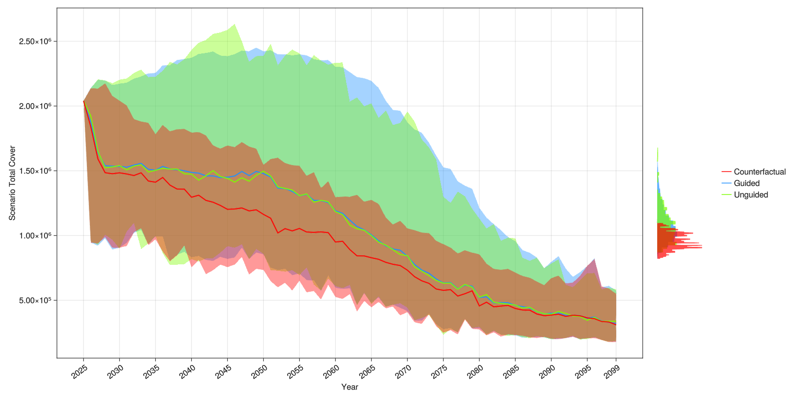

And compose a figure with subplots. In the example below we also use the parameter `opts`
that accepts the keys `by_RCP` to group scenarios by RCP (default is `false`), `legend`
to plot the legend (default is `true`) and `summarize` to plot confidence intervals instead
of plotting each series (default is `true`):

```julia
tf = Figure(size=(1600, 600))  # size of figure

# Implicitly create a single figure with 2 columns
ADRIA.viz.scenarios!(
    tf[1, 1],
    rs,
    s_tac;
    opts=Dict(:by_RCP => false, :legend => false),
    axis_opts=Dict(:title => "TAC [m²]"),
);
ADRIA.viz.scenarios!(
    tf[1, 2],
    rs,
    s_juves;
    opts=Dict(:summarize => false),
    axis_opts=Dict(:title => "Juveniles [%]"),
);

tf  # display the figure
save("aviz_scenario.png", tf)  # save the figure to a file
```

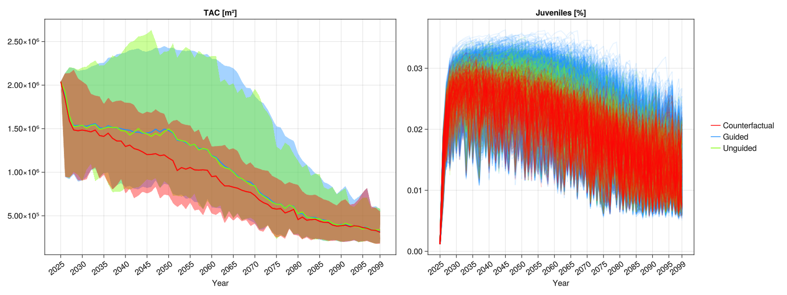

### Intervention location selection - visualisation

Plot spatial colormaps of site selection frequencies and other available site selection metrics.

```julia
# Calculate frequencies with which each site was selected at each rank
rank_freq = ADRIA.decision.ranks_to_frequencies(
    rs.ranks[intervention=1];
    agg_func=x -> dropdims(sum(x; dims=:timesteps); dims=:timesteps),
)

# Plot 1st rank frequencies as a colormap
rank_fig = ADRIA.viz.ranks_to_frequencies(rs, rank_freq, 1; fig_opts=Dict(:size=>(1200, 800)))

save("single_rank_plot.png", rank_fig)
```

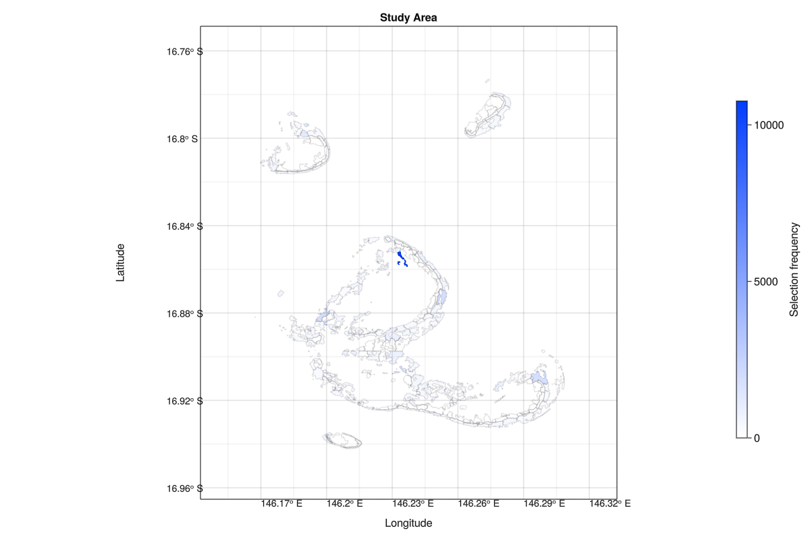

```julia
# Plot 1st, 2nd and 3rd rank frequencies as an overlayed colormap
rank_fig = ADRIA.viz.ranks_to_frequencies(rs, rank_freq, [1, 2, 3]; fig_opts=Dict(:size=>(1200, 800)))

save("ranks_plot.png", rank_fig)
```

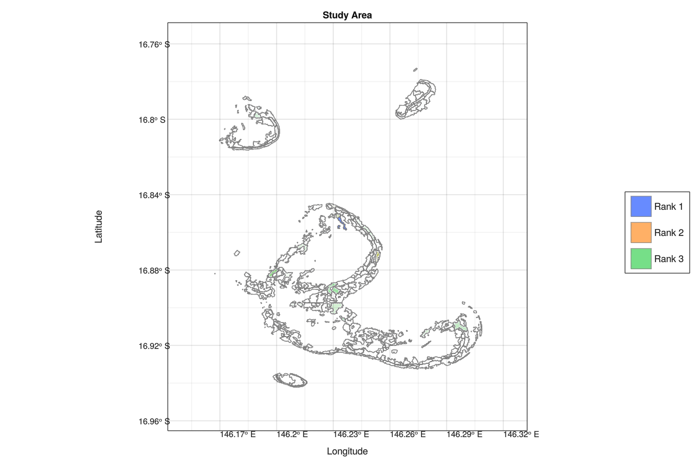

## Intervention location selection - plot criteria maps

```julia

mcda_funcs = ADRIA.decision.mcda_methods()

dom = ADRIA.load_domain("path to domain","45")

scens = ADRIA.sample_guided(dom, 2^2)
scen = scens[1, :]

# Get seeding preferences
seed_pref = ADRIA.decision.SeedPreferences(dom, scen)

# Calculate criteria vectors
# Cover
sum_cover = vec(sum(dom.init_coral_cover; dims=1).data)
# DHWS
dhw_scens = dom.dhw_scens[:, :, Int64(scen["dhw_scenario"])]
plan_horizon = Int64(scen["plan_horizon"])
decay = 0.99 .^ (1:(plan_horizon + 1)) .^ 2
dhw_projection = ADRIA.decision.weighted_projection(dhw_scens, 1, plan_horizon, decay, 75)
# Connectivity
area_weighted_conn = dom.conn.data .* ADRIA.loc_k_area(dom)
conn_cache = similar(area_weighted_conn)
in_conn, out_conn, network = ADRIA.connectivity_strength(
    area_weighted_conn, sum_cover, conn_cache
)

# Create decision matrix
seed_decision_mat = ADRIA.decision.decision_matrix(
    dom.loc_ids,
    seed_pref.names;
    seed_in_connectivity=in_conn,
    seed_out_connectivity=out_conn,
    seed_heat_stress=dhw_projection,
    seed_coral_cover=sum_cover
)

# Get results from applying MCDA algorithm
crit_agg = ADRIA.decision.criteria_aggregated_scores(
    seed_pref, seed_decision_mat, mcda_funcs[1]
)

# Don't plot constant criteria
is_const = Bool[length(x) == 1 for x in unique.(eachcol(seed_decision_mat.data))]

# Plot normalized scores and criteria as map
fig = ADRIA.viz.selection_criteria_map(
    dom, seed_decision_mat[criteria=.!is_const], crit_agg.scores ./ maximum(crit_agg.scores)
)
save("criteria_plots.png", fig)
```

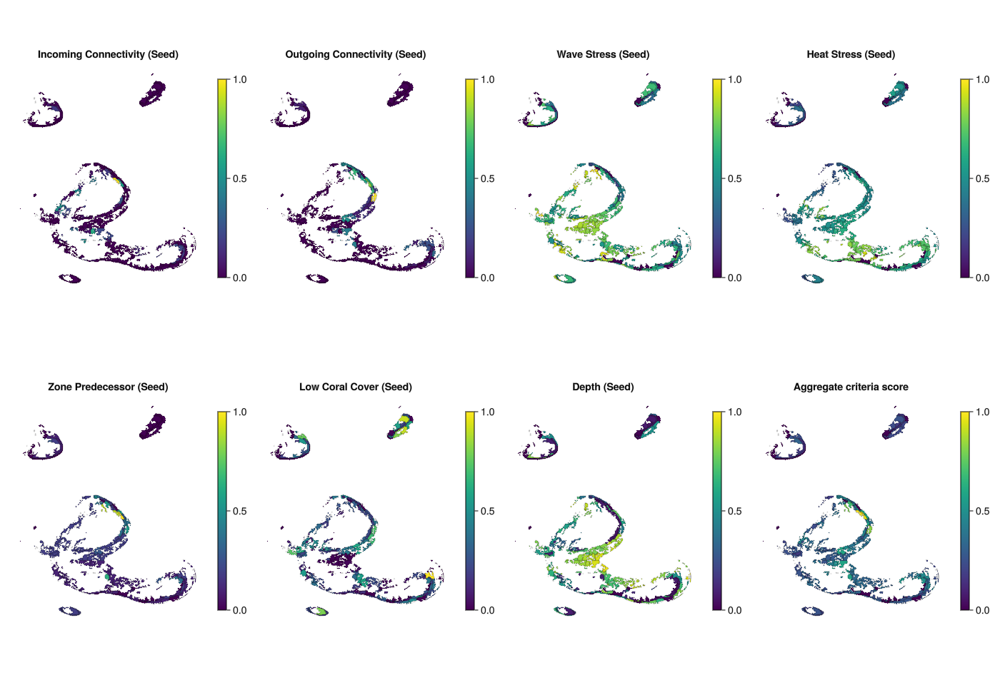

### PAWN sensitivity (heatmap overview)

The PAWN sensitivity analysis method is a moment-independent approach to Global Sensitivity
Analysis. It is described as producing robust results at relatively low sample sizes, and
is used to screen factors (i.e., identification of important factors) and rank factors as
well (ordering factors by their relative contribution towards a given quantity of interest).

```julia
# Sensitivity (of mean scenario outcomes to factors)
mean_s_tac = vec(mean(s_tac, dims=1))
tac_Si = ADRIA.sensitivity.pawn(rs, mean_s_tac)
pawn_fig = ADRIA.viz.pawn(
    tac_Si;
    opts,
    fig_opts
)
save("pawn_si.png", pawn_fig)
```

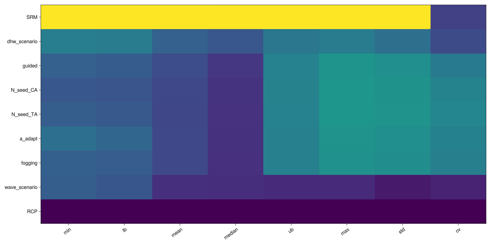

### Temporal Sensitivity Analysis

Temporal (or Time-varying) Sensitivity Analysis applies sensitivity analysis to model
outputs over time. The relative importance of factors and their influence on outputs over
time can then be examined through this analysis.

```julia
tsa_s = ADRIA.sensitivity.tsa(rs, s_tac)
tsa_fig = ADRIA.viz.tsa(
    rs,
    tsa_s;
    opts,
    fig_opts
)
save("tsa.png", tsa_fig)
```

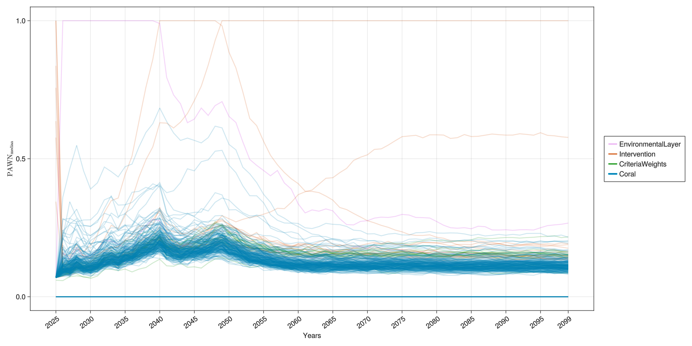

### Convergence Analysis

When undertaking sensitivity analysis it is important to have a sufficient number of samples
such that the sensitivity measure converges to a stable state. To assess whether sufficient
samples have been taken a convergence analysis can be conducted. One approach is to draw a
large sample and then iteratively assess stability of the sensitivity metric using an
increasing number of sub-samples. The sensitivity metric is described as having "converged"
if there is little to no fluctuations/variance for a given sample size. The analysis can
help determine if too little (or too many) samples have taken for the purpose of sensitivity
analysis.

The function `sensitivity.convergence` can be used to calculate a sensitivity measure for an
increasing number of samples. The result can then be plotted as band plots or a heat map
using `viz.convergence`.

```julia
outcome = dropdims(mean(ADRIA.metrics.scenario_total_cover(rs); dims=:timesteps), dims=:timesteps)

# Display convergence for specific factors of interest ("foi") within a single figure.
# Bands represent the 95% confidence interval derived from the number of conditioning
# points, the default for which is ten (i.e., 10 samples).
# Due to the limited sample size, care should be taken when interpreting the figure.
foi = [:dhw_scenario, :wave_scenario, :guided]
Si_conv = ADRIA.sensitivity.convergence(scens, outcome, foi)
conv_series_fig = ADRIA.viz.convergence(Si_conv, foi)
save("convergence_factors_series.png", conv_series_fig)

# Convergence analysis of factors grouped by model component as a heat map
components = [:EnvironmentalLayer, :Intervention, :Coral]
Si_conv = ADRIA.sensitivity.convergence(rs, scens, outcome, components)
conv_hm_fig = ADRIA.viz.convergence(Si_conv, components; opts=Dict(:viz_type=>:heatmap))
save("convergence_components_heatmap.png", conv_hm_fig)
```

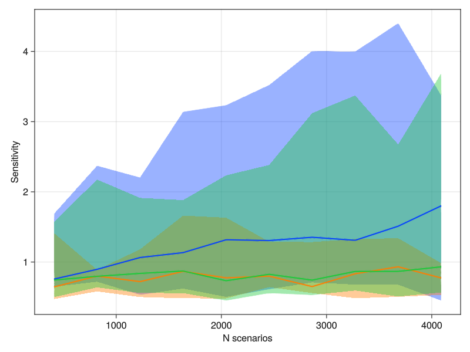
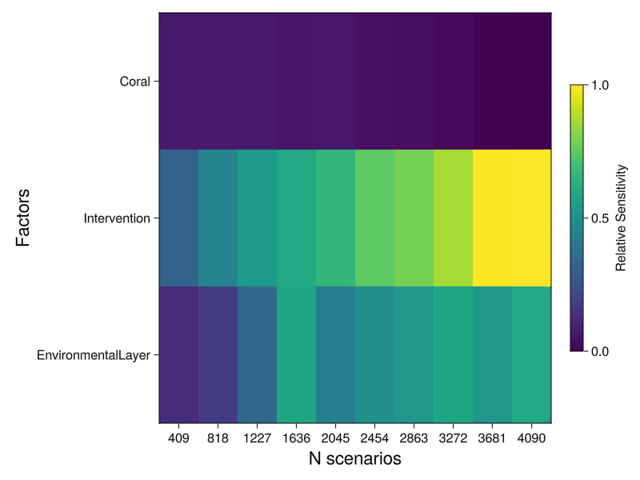

### Time Series Clustering

The Time Series Clustering algorithm clusters together series (typically time series)
with similar behavior. This is achieved by computing the Euclidian distance between each
pair of series weighted by a correlation factor that takes into account the quotient
between their complexities. When plotting `clustered_scenarios`, the kwarg `opts` can be
used with the key `:summarize` to plot the confidence intervals of each cluster instead of
each series individually (default is `true`).

```julia
# Extract metric from scenarios
s_tac = ADRIA.metrics.scenario_total_cover(rs)

# Cluster scenarios
n_clusters = 4
clusters = ADRIA.analysis.cluster_scenarios(s_tac, n_clusters)

axis_opts = Dict(
    :title => "Time Series Clustering with $n_clusters clusters",
    :ylabel => "TAC [m²]",
    :xlabel => "Timesteps [years]",
)
opts = Dict{Symbol, Any}(:summarize => true)

tsc_fig = ADRIA.viz.clustered_scenarios(
    s_tac, clusters; opts=opts, fig_opts=fig_opts, axis_opts=axis_opts
)

# Save final figure
save("tsc.png", tsc_fig)
```

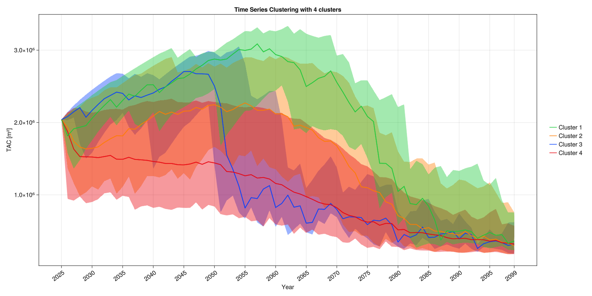

### Target clusters

One can also target scenarios that belong to specific clusters (like clusters with higher
median value for some outcome):

```julia
# Extract metric from scenarios
asv = ADRIA.metrics.absolute_shelter_volume(rs)

# Time series summarizing scenarios for each site
asv_site_series = ADRIA.metrics.loc_trajectory(median, asv)

# Cluster scenarios
n_clusters = 6
asv_clusters = ADRIA.analysis.cluster_scenarios(asv_site_series, n_clusters)

# Target scenarios that belong to the two lowest value clusters
lowest = x -> x .∈ [sort(x; rev=true)[1:2]]
asv_target = ADRIA.analysis.find_scenarios(asv_site_series, asv_clusters, lowest)

# Plot targeted scenarios
axis_opts = Dict(:ylabel => "Absolute Shelter Volume", :xlabel => "Timesteps [years]")

tsc_asc_fig = ADRIA.viz.clustered_scenarios(
    asv_site_series, asv_target; axis_opts=axis_opts, fig_opts=fig_opts
)

# Save final figure
save("tsc_asv.png", tsc_asc_fig)
```

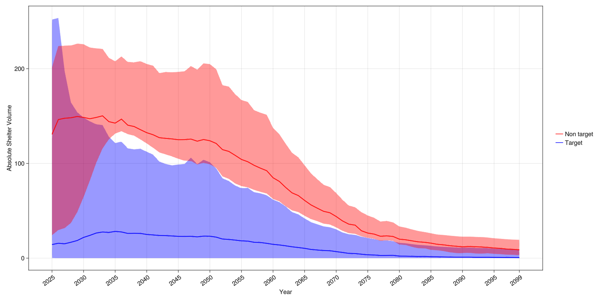

### Multiple Time Series Clustering

It is possible to perform time series clustering for different metric outcomes and find
scenarios that behave the same across all of them. Currently there is no visualization
function for this.

```julia
metrics::Vector{ADRIA.metrics.Metric} = [
    ADRIA.metrics.scenario_total_cover,
    ADRIA.metrics.scenario_asv,
    ADRIA.metrics.scenario_absolute_juveniles,
]

outcomes = ADRIA.metrics.scenario_outcomes(rs, metrics)
n_clusters = 6

# Clusters matrix
outcomes_clusters::AbstractMatrix{Int64} = ADRIA.analysis.cluster_scenarios(
    outcomes, n_clusters
)

# Filter scenarios that belong to on of the 4 high value clusters for all outcomes
highest_clusters(x) = x .∈ [sort(x; rev=true)[1:4]]
robust_scens = ADRIA.analysis.find_scenarios(outcomes, outcomes_clusters, highest_clusters)
```

### Time Series Clustering Map

When using Time Series Clustering to cluster among multiple locations using some metric, it
is possible to visualize the result as a map.

```julia
# Extract metric from scenarios
tac = ADRIA.metrics.total_absolute_cover(rs)

# Get a timeseries summarizing the scenarios for each site
tac_site_series = ADRIA.metrics.loc_trajectory(median, tac)

# Cluster scenarios
n_clusters = 6
clusters = ADRIA.analysis.cluster_scenarios(tac_site_series, n_clusters)

# Get a vector summarizing the scenarios and timesteps for each site
tac_sites = ADRIA.metrics.per_loc(median, tac)

# Plot figure
tsc_map_fig = ADRIA.viz.map(rs, tac_sites, clusters)

# Save final figure
save("tsc_map.png", tsc_map_fig)
```

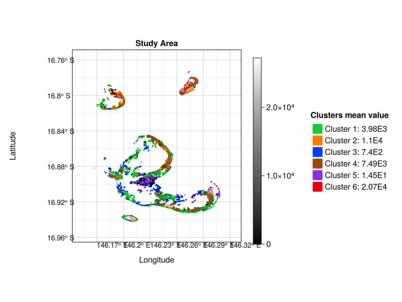

### Rule Induction (using Series Clusters)

The SIRUS Rule Induction algorithm ([Bénard et al. 2021](https://doi.org//10.1214/20-EJS1792)) can be used for scenario discovery by summarising scenarios in terms of binary rules, 
i.e. thresholds below/above which a factor will lead to a specified outcome.

For this example, we cluster scenarios with similar total cover, and then focus on those with high temporal variability in total cover. We explore what intervention characteristics lead to high temporal variability.


```julia
# Find Time Series Clusters
s_tac = ADRIA.metrics.scenario_total_cover(rs)
n_clusters = 6
clusters = ADRIA.analysis.cluster_scenarios(s_tac, n_clusters)

# Identify cluster(s) with highest median temporal variability covering at least 1% of scenarios
# N.B. different aggregation metrics and size limits could also be specified
target_clusters = ADRIA.analysis.target_clusters(clusters, s_tac)
```

When the SIRUS Rule Induction algorithm produces rules involving two factors, they can be visualised as scatterplots.

```julia
# Select features of interest to use in rules.
# This includes all factors related to interventions and criteria to decide where to perform coral seeding.
foi = ADRIA.component_params(rs, [Intervention, SeedCriteriaWeights]).fieldname

# Use SIRUS algorithm to extract up to 10 rules.
max_rules = 10
rules_iv = ADRIA.analysis.cluster_rules(
    rs, target_clusters, scens, foi, max_rules; remove_duplicates=true
)


# Plot scatterplots for each rule highlighting the area selected by each of them
rules_scatter_fig = ADRIA.viz.rules_scatter(
    rs,
    scens,
    target_clusters,
    rules_iv;
    fig_opts=fig_opts,
    opts=opts
)

# Save final figure
save("rules_scatter.png", rules_scatter_fig)
```

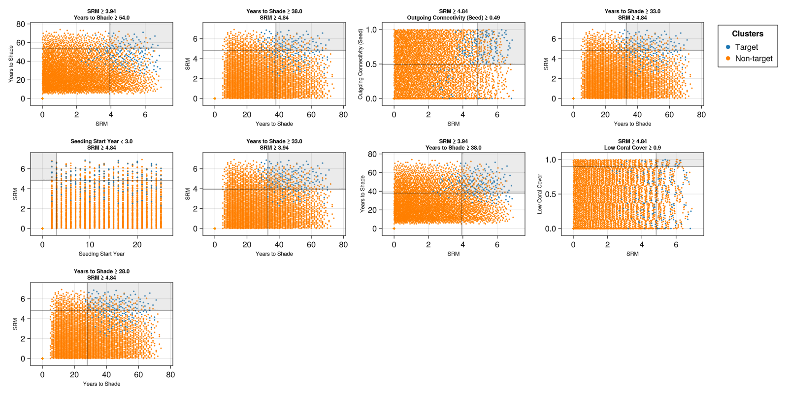

When defining binary rules, it is expected that there will be a tradeoff between coverage and density ([Bryant & Lempert 2010](https://dx.doi.org/10.1016/j.techfore.2009.08.002)).
Not all target scenarios will be captured (low coverage), and not all scenarios captured by the rule will be target scenarios (low density).
It is possible for a rule to increase coverage by accepting lower density,
and density can often be increased by accepting lower coverage.

In these results, a number of rules have many blue points outside the grey area - the rule has low coverage of the target scenarios, e.g., in SRM > 3.94 & Years to Shade > 54.0. 

A number of rules also have many orange points within the grey area - the rule has low density of target scenarios, e.g., SRM > 3.94 & Years to Shade > 38.0. 

SRM and Years to Shade have been selected as key factors in several of the rules. In this dataset, high temporal variability is obtained when a large reduction in DHW is applied, and for a long period of time. This may reflect a large increase in coral cover - but would need further investigation.

Rules also suggest that high temporal variability is also obtained when putting high weight on selecting locations with high outgoing connectivity and low coral cover - in combination with high shading. The rule favouring low coral cover has very low coverage - there are many target scenarios that also do not have low coral cover.

For this dataset, according to this analysis:

1) **Ensuring conditions for success**: Temporal variability might be a proxy for high improvement over time, and the scenarios could be visualised or another more specific metric could be used to verify this. It would be unsurprising for high shading to support success.
2) **Avoiding failure**: Binary rules implicitly define scenarios that are excluded. High temporal variability is rarely achieved without high levels of shade.
3) **Planning for failure modes**: A recommendation to favour locations with high outgoing connectivity combined with high SRM seems like it would warrant further investigation - the rule includes many target scenarios (high coverage), but also many scenarios with lower temporal variability (high density).
4) **Further deliberation**: The rules describe very high levels of shading for long periods of time, which may be difficult to achieve. Temporal variability is not directly connected with measures of success - alternative metrics to summarise clusters could be explored. Other algorithms, e.g., PRIM, could also be used to give greater control over coverage and density ([Bryant & Lempert 2010](https://dx.doi.org/10.1016/j.techfore.2009.08.002)).

### Regional Sensitivity Analysis

Regional Sensitivity Analysis is a monte-carlo filtering approach. The aim of RSA is to aid
in identifying which (group of) factors drive model outputs and their active areas of
factor space.

```julia
mean_s_tac = dropdims(mean(s_tac, dims=1), dims=1)

tac_rs = ADRIA.sensitivity.rsa(rs, mean_s_tac; S=10)
rsa_fig = ADRIA.viz.rsa(
    rs,
    tac_rs,
    [:dhw_scenario, :wave_scenario, :N_seed_TA, :N_seed_CA, :fogging, :SRM];
    opts,
    fig_opts
)

save("rsa.png", rsa_fig)
```

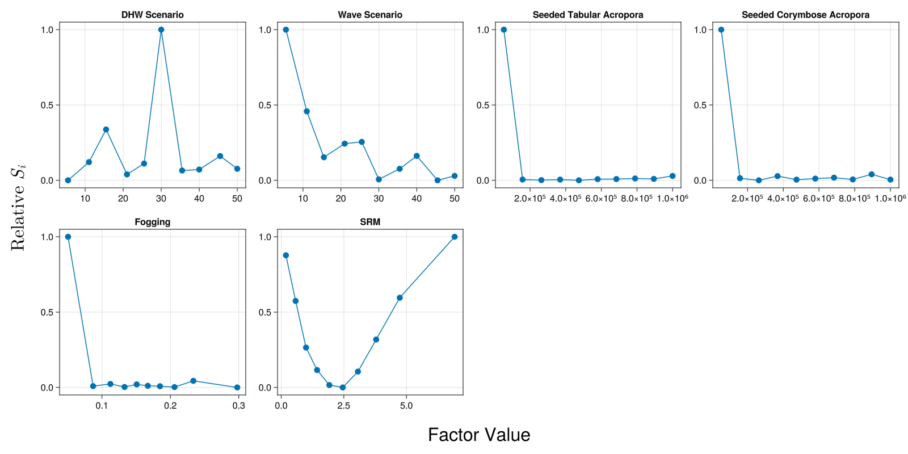

### Outcome mapping

A monte-carlo filtering approach similar to Regional Sensitivity Analysis.

As the name implies, outcome mapping aids in identifying the relationship between model
outputs and the region of factor space that led to those outputs.

```julia
mean_s_tac = dropdims(mean(s_tac, dims=1), dims=1)

tf = Figure(size=(1600, 1200))  # size of figure

# Indicate factor values that are in the top 50 percentile
tac_top_50 = ADRIA.sensitivity.outcome_map(rs, mean_s_tac, x -> any(x .>= 0.5), foi; S=20)
ADRIA.viz.outcome_map!(
    tf[1, 1],
    rs,
    tac_top_50,
    foi;
    axis_opts=Dict(:title => "Regions which lead to Top 50th Percentile Outcomes", :ylabel => "TAC [m²]")
)

# Indicate factor values that are in the top 30 percentile
tac_top_30 = ADRIA.sensitivity.outcome_map(rs, mean_s_tac, x -> any(x .>= 0.7), foi; S=20)
ADRIA.viz.outcome_map!(
    tf[2, 1],
    rs,
    tac_top_30,
    foi;
    axis_opts=Dict(:title => "Regions which lead to Top 30th Percentile Outcomes", :ylabel => "TAC [m²]"))

save("outcome_map.png", tf)
```

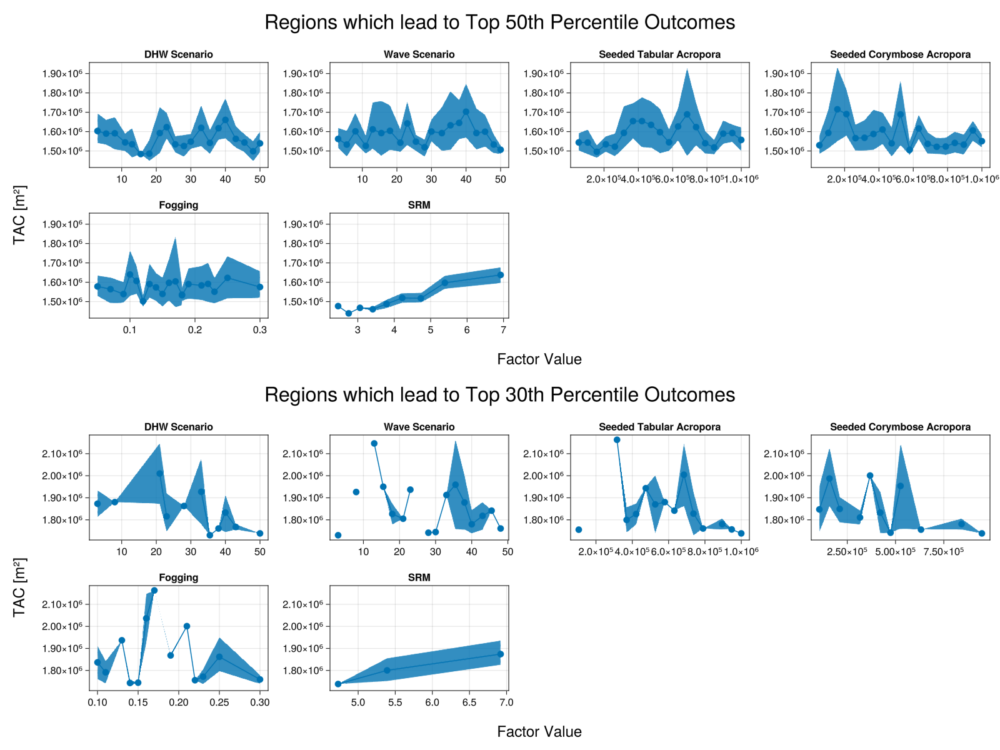

### Data Envelopment Analysis

Performs output-oriented (default, input-oriented can also be applied) Data Envelopment Analysis (DEA)
given inputs X and output metrics Y. DEA is used to measure the performance of entities (scenarios),
where inputs are converted to outputs via some process. Each scenario's "efficiency score" is calculated
relative to an "efficiency fromtier", a region representing scenarios for which outputs cannot be further
increased by changing inputs (scenario settings).

```julia
dom = ADRIA.load_domain("path to domain", "45")

scens = ADRIA.sample(dom, 128)
rs = ADRIA.run_scenarios(dom, scens, "45")

n_scens = size(scens,1)

# Get cost of deploying corals in each scenario, with user-specified function
cost = cost_function(scens)

# Get mean coral cover and shelter volume for each scenario
s_tac = dropdims(
    mean(ADRIA.metrics.scenario_total_cover(rs); dims=:timesteps); dims=:timesteps
)
s_sv =
    dropdims(
        mean(mean(ADRIA.metrics.absolute_shelter_volume(rs); dims=:timesteps); dims=:locations);
        dims=(:timesteps,:locations)
    )

# Do output oriented DEA analysis seeking to maximise cover and shelter volume for minimum
# deployment cost.
DEA_scens = ADRIA.analysis.data_envelopment_analysis(cost, s_tac, s_sv)
dea_fig = ADRIA.viz.data_envelopment_analysis(rs, DEA_scens)

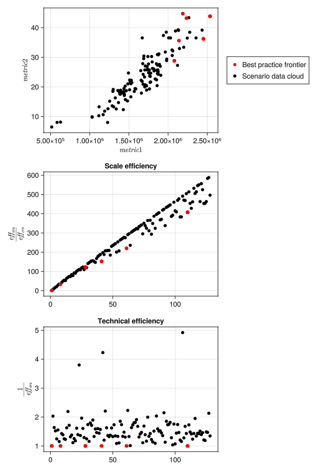
```

### GUI for high-level exploration (prototype only!)

```julia
# To explore results interactively
ADRIA.viz.explore("path to Result Set")

# or, if the result set is already loaded:
# ADRIA.viz.explore(rs)
```

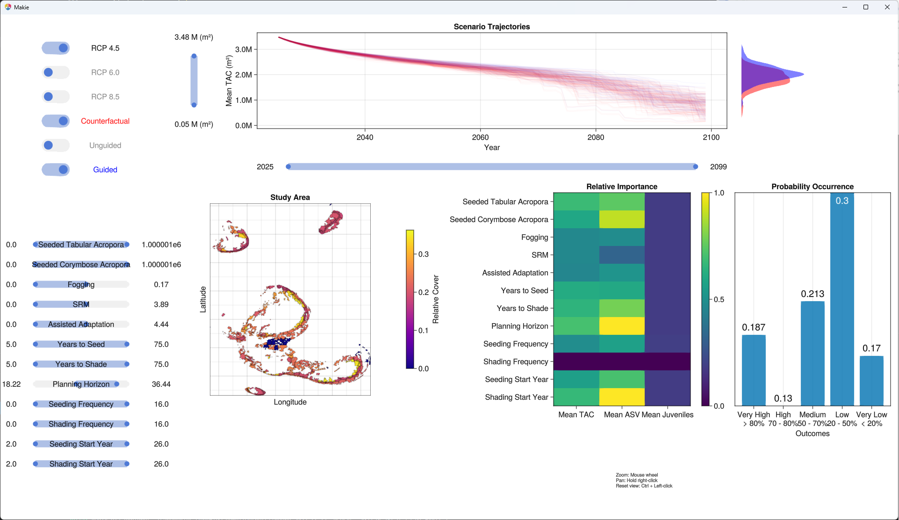
